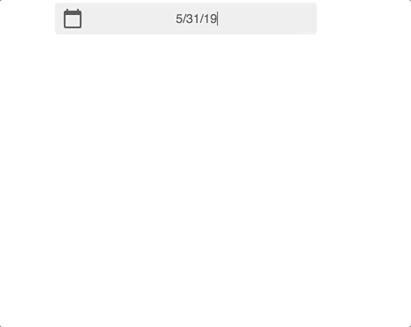
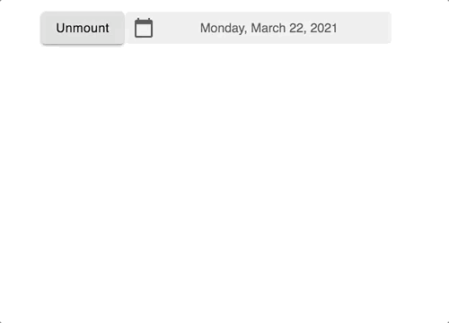
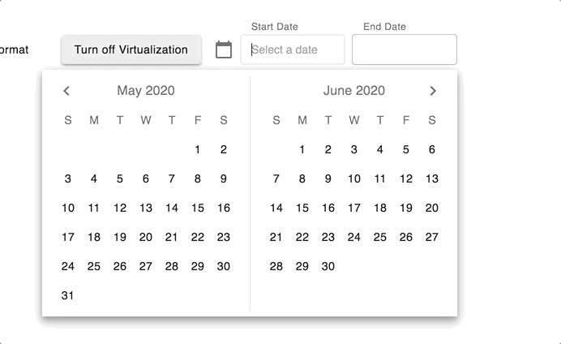

# UI Components in React / Typescript

## Low Level Component Programming

### Project Focus : Advanced components built with primitive lego blocks from Material UI

#### Performance

- Art of avoiding work, and making any work you do as efficient as possible. In many cases it's about working with the browser, not against it. - Paul Lewis [Google Dev Guide](https://developers.google.com/web/fundamentals/performance/rendering/)

#### Components

##### Date Selector Components: Windowing is achieved by virtualization. Animations in the calendar are imperative via the Web API 'requestAnimationFrame'. Supports +41 / -41 years in the future/past.

- Date Selector: React Spring for open close / error animations. Supports text field & mouse date selection. (Done)

- Date Range Selector: Supports selection via ranges by text fields and mouse selection. Supports Virtualization + Animating via props flag `disableVirtualization` (WIP)

- Fold View: Component that handles all rotations and 3d perspectives and the user can just handle passing
React Nodes / JSX to the interface. (WIP)

- Scroll Sync: Component that feeds scroll top to its children to meet a specific API. (WIP)

#### Design System

- https://material.io/components/

#### Development

- Run `npm i`
- Then run `npm run dev`

#### Library

- Run `npm run build`
